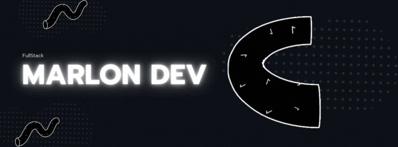

  

  

 

  
  
  

  

  &nbsp;
  </a>
 <a href="#" onclick="return false;">
  &nbsp;
     </a>

 <a href="#" onclick="return false;">
  &nbsp;
    </a>
    <a href="#" onclick="return false;">
  &nbsp;
       </a>
       <a href="#" onclick="return false;">
  &nbsp;
      </a>    
 <a href="#" onclick="return false;">
  &nbsp;
    </a>
    <a href="#" onclick="return false;">
  &nbsp;
       </a>
 

<!--Profile Count Badge-->

  

<!--Languages and Tools Section-->       
<h2 align="center">🧩 Tᴇᴄʜ Sᴛᴀᴄᴋ & Pʀᴏʏᴇᴄᴛᴏs Rᴇᴄɪᴇɴᴛᴇs</h2> 

<picture>
  <source media="(prefers-color-scheme: dark)" srcset="./Skills_Animation_Dark.gif">
  <source media="(prefers-color-scheme: light)" srcset="./Skills_Animation_White.gif">
  
  
</picture>
 

<h3 align="left">🚀 Stack actual: Full Stack Developer</h3>
<ul align="left">
  <li><strong>Frontend:</strong> Angular + TailwindCSS</li>
  <li><strong>Backend:</strong> Spring Boot + REST APIs</li>
  <li><strong>Base de datos:</strong> MySQL / PostgreSQL</li>
  <li><strong>Otros:</strong> Docker, Git, Postman, Swagger</li>
</ul>

<h3 align="left">📚 Aprendiendo actualmente</h3>
<ul align="left">
  <li>Profundizando en arquitectura hexagonal con Spring Boot.</li>
  <li>Mejorando la escalabilidad en proyectos Angular empresariales.</li>
  <li>Automatización de pruebas con Postman y JUnit.</li>
  <li>Refinando patrones de diseño para aplicaciones mantenibles.</li>
</ul>

